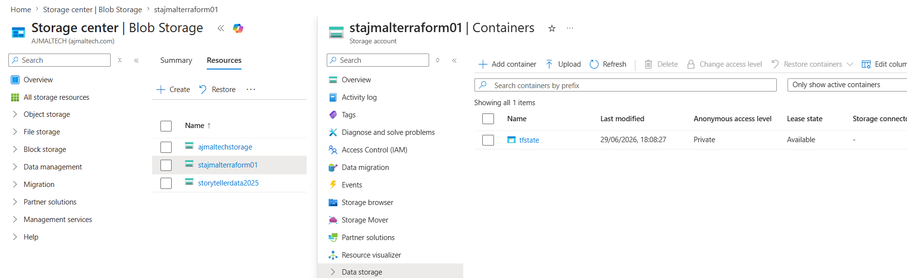
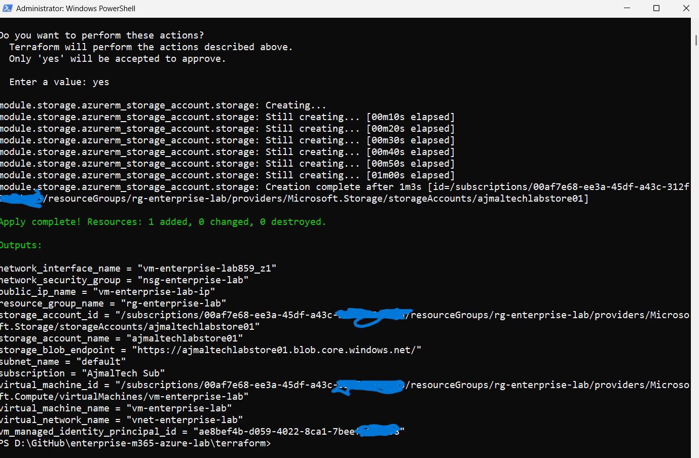
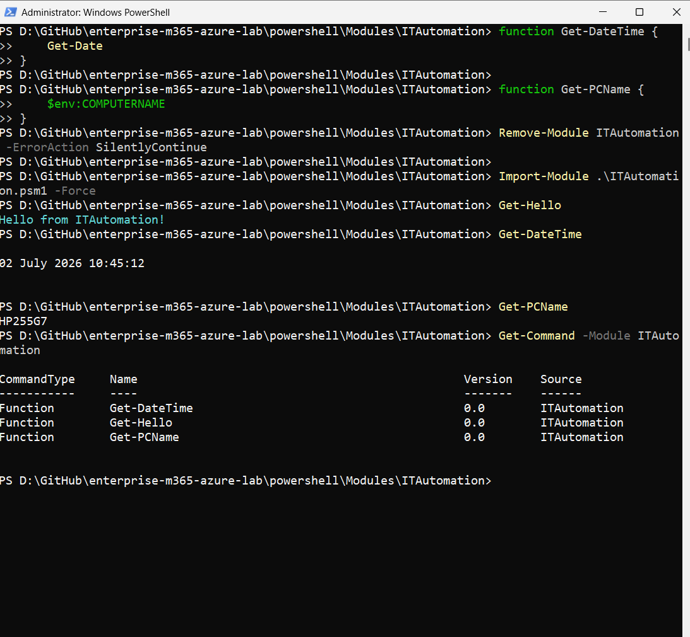
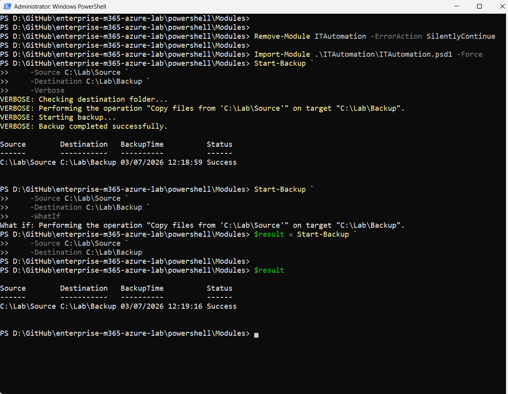
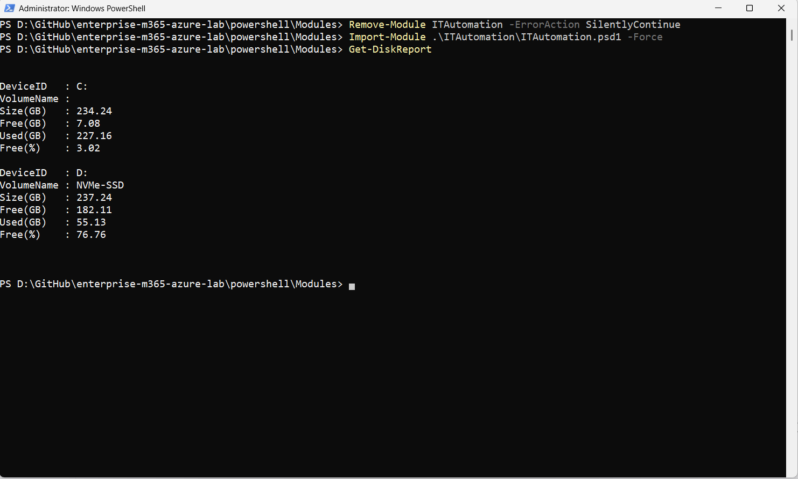
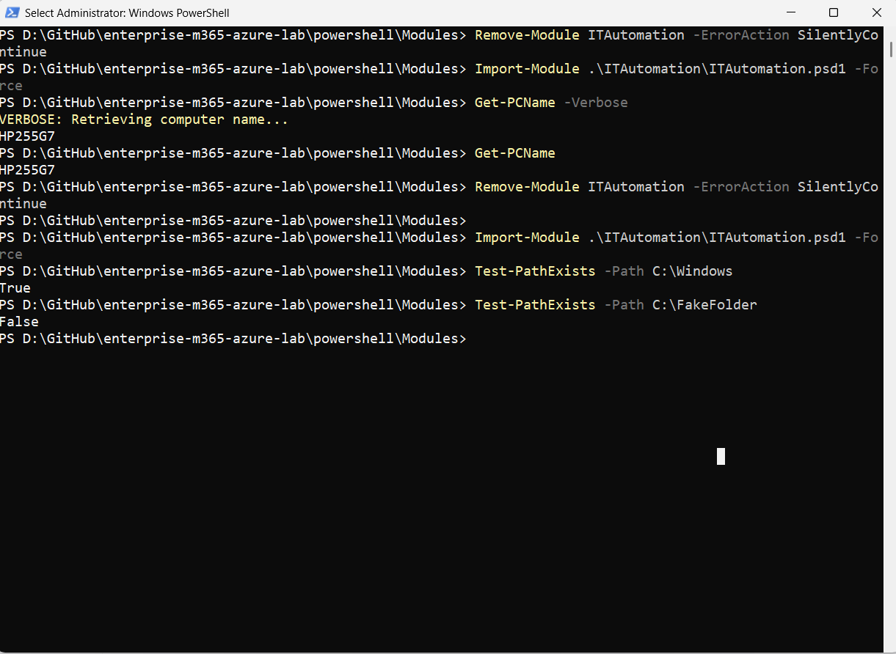
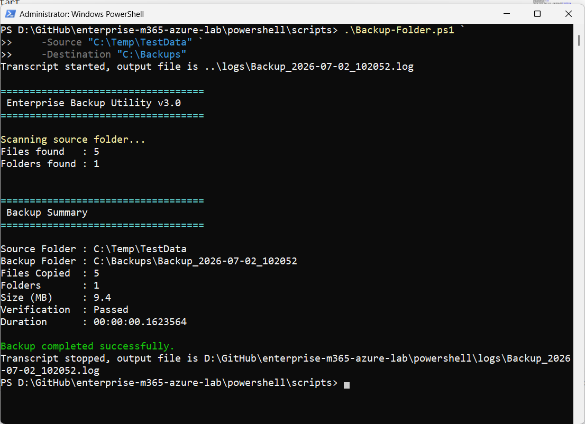

# Enterprise Microsoft 365 & Azure Lab

> A comprehensive cloud engineering portfolio project demonstrating Microsoft Azure, Terraform, GitHub Actions, Microsoft Entra ID, Microsoft Intune, Linux administration, and enterprise PowerShell automation.


---

# Project Overview

The **Enterprise Microsoft 365 & Azure Lab** is a hands-on cloud engineering project designed to simulate real-world enterprise environments using Microsoft cloud technologies and Infrastructure as Code (IaC).

The project combines Azure infrastructure deployment, Microsoft 365 administration, Linux server configuration, Terraform automation, GitHub Actions, and enterprise PowerShell module development into a single portfolio repository.

Rather than focusing on isolated exercises, the repository demonstrates how multiple technologies work together to build, automate, secure, and manage enterprise infrastructure using industry best practices.

---

# Project Objectives

- Build enterprise Azure infrastructure using Infrastructure as Code
- Demonstrate Terraform module development and remote state management
- Configure Microsoft Entra ID identity services
- Deploy and manage Microsoft Intune devices
- Develop reusable PowerShell automation modules
- Automate validation using GitHub Actions
- Produce professional technical documentation
- Showcase practical cloud engineering skills

---

# Architecture

The overall solution architecture is shown below.


---

# Technologies Used

| Category | Technologies |
|-----------|--------------|
| Cloud Platform | Microsoft Azure |
| Infrastructure as Code | Terraform |
| Automation | PowerShell 7 |
| Identity | Microsoft Entra ID |
| Device Management | Microsoft Intune |
| Operating System | Ubuntu Server 24.04 LTS |
| Security | UFW Firewall, Fail2Ban |
| CI/CD | GitHub Actions |
| Version Control | Git & GitHub |

---

# Key Features

## Azure Infrastructure

- Azure Resource Group
- Virtual Network
- Network Security Group
- Ubuntu Virtual Machine
- Azure Storage Account
- Remote Terraform Backend

### Azure Storage Account



## Infrastructure as Code

- Modular Terraform configuration
- Reusable Terraform modules
- Remote backend
- State migration
- Variable driven deployments

## Enterprise PowerShell

- Reusable PowerShell module
- Advanced Functions
- Module Manifest
- Logging Framework
- Backup Automation
- Disk Reporting
- Parameter Validation
- Pipeline Support
- Comment-Based Help

## Identity & Device Management

- Microsoft Entra ID
- Conditional Access
- Security Groups
- Microsoft Intune
- Device Compliance Policies
- Application Deployment

## DevOps

- GitHub Actions
- Terraform validation
- Terraform formatting
- Automated planning
- OIDC authentication

---

# Why This Project?

This repository was created to demonstrate practical cloud engineering skills using technologies commonly found in enterprise IT environments.

It focuses on automation, Infrastructure as Code, documentation, modular design, and repeatable deployments rather than simple proof-of-concept examples.

The project continues to evolve as additional Azure services, Microsoft 365 automation, and PowerShell functionality are added.


---

# Repository Structure

The repository is organised into logical components, separating infrastructure, automation, documentation, and supporting resources.

```text
enterprise-m365-azure-lab
│
├── .github/                 # GitHub Actions CI workflows
├── diagrams/                # Architecture diagrams
├── docs/                    # Technical documentation
├── powershell/              # Enterprise PowerShell automation
├── screenshots/             # Project screenshots
├── terraform/               # Infrastructure as Code
│
├── README.md
├── CHANGELOG.md
└── LICENSE
```

This structure follows a modular approach, making the project easy to navigate, maintain, and extend.

---

# Azure Infrastructure

The Azure environment was designed to simulate a small enterprise deployment using Infrastructure as Code.

The Terraform configuration provisions and manages the following Azure resources:

| Resource | Purpose |
|----------|---------|
| Resource Group | Logical container for Azure resources |
| Virtual Network | Private network for cloud resources |
| Network Security Group | Controls inbound and outbound traffic |
| Network Interface | Connects the virtual machine to the network |
| Public IP Address | Secure remote administration |
| Ubuntu Server 24.04 LTS | Linux administration and automation |
| Storage Account | Remote Terraform backend |
| Blob Container | Stores Terraform state files |

The environment is designed to be reproducible, modular, and easy to expand with additional Azure services.

---

# Terraform Infrastructure

Infrastructure is managed entirely through Terraform using reusable modules.

## Current Modules

| Module | Description |
|---------|-------------|
| Resource Group | Creates Azure Resource Groups |
| Networking | Deploys Virtual Network and NSG |
| Storage | Creates Storage Account and Blob Container |
| Compute | Deploys the Ubuntu Virtual Machine |

## Infrastructure Highlights

- Modular Terraform architecture
- Remote state stored in Azure Storage
- Azure AD authentication
- State locking
- Variable-driven deployments
- Reusable module design
- Infrastructure validation
- GitHub Actions integration

### Terraform Apply



The Terraform configuration follows Infrastructure as Code best practices, allowing infrastructure to be deployed consistently across environments.

---

# Enterprise PowerShell Automation

The project includes a reusable PowerShell module named **ITAutomation**.

Unlike standalone scripts, the module is organised using enterprise PowerShell development practices, making it scalable, reusable, and easy to maintain.

### ITAutomation Module



## Module Features

- Advanced Functions
- Module Manifest (.psd1)
- Module File (.psm1)
- Automatic Function Loading
- Comment-Based Help
- Parameter Validation
- Pipeline Support
- Enterprise Logging
- Backup Automation
- Storage Reporting
- Structured Object Output
- Supports `-Verbose`, `-WhatIf`, and `-Confirm`

### Available Cmdlets

| Cmdlet | Description |
|---------|-------------|
| Get-PCName | Returns the local computer name |
| Get-DateTime | Returns the current date and time |
| Get-Greeting | Demonstrates advanced parameter validation |
| Get-Hello | Sample module function |
| Test-PathExists | Validates whether a file or folder exists |
| Get-DiskReport | Displays local disk usage information |
| Write-Log | Enterprise logging utility |
| Start-Backup | Performs folder backups with logging and WhatIf support |


### Backup Automation




### Module Structure

```text
ITAutomation
│
├── Public
│   ├── Backup
│   ├── Logging
│   ├── Storage
│   ├── System
│   └── Validation
│
├── Private
│
├── ITAutomation.psd1
└── ITAutomation.psm1
```

The module demonstrates enterprise PowerShell development concepts including reusable architecture, modular design, advanced functions, structured output, and automation best practices.

### Storage Reporting




### Parameter Validation



---

# PowerShell Skills Demonstrated

The ITAutomation module demonstrates practical PowerShell development skills including:

- Module development
- Advanced Functions
- CmdletBinding
- Comment-Based Help
- Parameter Validation
- Error Handling
- Logging Framework
- Pipeline Support
- Object-Oriented Output
- SupportsShouldProcess (`-WhatIf` / `-Confirm`)
- Enterprise folder structure
- Reusable automation design

The module is intended to serve as a foundation for future automation covering Azure, Microsoft 365, Microsoft Graph, Active Directory, and Windows Server administration.


---

# Continuous Integration & Deployment (CI/CD)

Infrastructure validation is automated using **GitHub Actions**, ensuring Terraform configurations are validated before deployment.

### GitHub Actions Workflow


## CI Pipeline

The workflow performs the following automated tasks:

- Terraform initialization
- Terraform formatting validation (`terraform fmt`)
- Terraform configuration validation (`terraform validate`)
- Terraform execution planning (`terraform plan`)
- Azure authentication using OpenID Connect (OIDC)

This pipeline demonstrates Infrastructure as Code validation and modern cloud deployment practices without relying on long-lived credentials.

---

# Technical Documentation

Comprehensive documentation has been created throughout the project to explain design decisions, deployment procedures, and implementation details.

## Documentation Index

| Category | Description |
|----------|-------------|
| Architecture | Overall solution architecture |
| Azure | Azure VM deployment and Terraform implementation |
| Microsoft Entra ID | Identity and Conditional Access configuration |
| Microsoft Intune | Device enrolment, compliance policies and application deployment |
| PowerShell | Coding standards and module development |

The documentation is intended to mirror the level of detail commonly found within enterprise IT environments, enabling deployments to be reproduced and maintained.

---

# Project Screenshots

The repository includes screenshots captured throughout the implementation process to demonstrate successful deployments and configuration.

Examples include:

- Azure infrastructure deployment
- Terraform execution
- Remote backend configuration
- GitHub Actions pipeline
- Ubuntu server administration
- Microsoft Entra ID
- Microsoft Intune device management
- Conditional Access policies


## Azure Infrastructure


---

## GitHub Actions


---

## Enterprise PowerShell



---

## Storage Reporting


These screenshots provide visual evidence of the completed implementation and support the accompanying technical documentation.

---

# Skills Demonstrated

This project demonstrates practical experience across multiple areas of modern cloud and infrastructure engineering.

## Microsoft Azure

- Azure Resource Manager (ARM)
- Virtual Networking
- Storage Accounts
- Linux Virtual Machines
- Identity and Access Management
- Remote administration using SSH

## Infrastructure as Code

- Terraform
- Modular architecture
- Remote backend
- State migration
- Variables and outputs
- Infrastructure validation
- Reusable modules

## Automation

- Enterprise PowerShell module development
- Advanced PowerShell Functions
- Logging framework
- Backup automation
- Storage reporting
- Parameter validation
- Pipeline support

## Microsoft 365

- Microsoft Entra ID
- Conditional Access
- Security Groups
- User administration
- Microsoft Intune
- Device compliance
- Application deployment

## Linux Administration

- Ubuntu Server 24.04 LTS
- SSH administration
- UFW Firewall
- Fail2Ban
- Swap configuration
- Package management

## DevOps

- Git
- GitHub
- GitHub Actions
- CI/CD pipelines
- OpenID Connect (OIDC)

---

# Learning Outcomes

This project was developed to gain practical experience in designing, deploying, securing, automating, and documenting enterprise cloud environments.

Key learning outcomes include:

- Applying Infrastructure as Code principles using Terraform
- Building reusable and modular infrastructure
- Managing Azure resources through automation
- Implementing enterprise identity and device management
- Developing reusable PowerShell modules
- Automating validation using GitHub Actions
- Producing professional technical documentation
- Following Git and GitHub best practices

Rather than focusing solely on individual technologies, this repository demonstrates how cloud infrastructure, automation, identity management, documentation, and DevOps practices integrate to support modern enterprise IT operations.

---

# Project Status

> **Current Status:** ✅ Active Portfolio Project

The core objectives of this repository have been completed.

Current implementation includes:

- Azure infrastructure deployment
- Terraform Infrastructure as Code
- Modular Terraform architecture
- Remote Terraform backend
- GitHub Actions CI pipeline
- Microsoft Entra ID configuration
- Microsoft Intune device management
- Enterprise PowerShell automation module
- Technical documentation
- Architecture diagrams

Future enhancements will focus on expanding automation capabilities and additional Azure services while maintaining enterprise development standards.


---

# Future Roadmap

Although the core objectives of this repository have been completed, it will continue to evolve as additional enterprise technologies are explored.

## Planned Enhancements

### Microsoft Azure

- Azure Key Vault
- Azure Monitor
- Log Analytics Workspace
- Azure Backup
- Azure Bastion
- Azure Automation Accounts

### Microsoft 365

- Microsoft Graph PowerShell SDK
- Microsoft Teams administration
- Exchange Online automation
- SharePoint Online automation
- Microsoft Defender integration

### PowerShell

- Pester unit testing
- PSScriptAnalyzer integration
- PowerShell Gallery publishing
- Configuration management
- REST API integration
- Scheduled automation

### DevOps

- Multi-stage GitHub Actions workflows
- Automated testing
- Release pipelines
- Semantic versioning
- Infrastructure drift detection

---

# Repository Highlights

This project demonstrates practical experience across multiple cloud engineering disciplines within a single repository.

## Highlights

- Enterprise Azure infrastructure deployment
- Infrastructure as Code using Terraform
- Modular Terraform architecture
- Remote Terraform backend
- GitHub Actions CI pipeline
- Enterprise PowerShell automation module
- Microsoft Entra ID administration
- Microsoft Intune administration
- Linux server administration
- Professional technical documentation

The repository is designed to reflect real-world engineering practices including modular architecture, automation, documentation, version control, and continuous improvement.

---

# Lessons Learned

Developing this project provided valuable experience in designing, implementing, documenting, and maintaining cloud infrastructure using modern engineering practices.

Some of the key lessons include:

- Designing reusable Terraform modules improves scalability and maintainability.
- Remote Terraform state enables collaborative Infrastructure as Code workflows.
- GitHub Actions simplifies infrastructure validation and deployment.
- Enterprise PowerShell modules are significantly more maintainable than standalone scripts.
- Technical documentation is as important as the implementation itself.
- Small, incremental commits create a much clearer project history than infrequent large commits.
- Automation should prioritise repeatability, consistency, and readability.

This project has reinforced the importance of treating infrastructure as software through version control, automation, documentation, and continuous improvement.

---

# Repository Statistics

| Category | Status |
|-----------|--------|
| Azure Infrastructure | ✅ Completed |
| Terraform Deployment | ✅ Completed |
| Terraform Modules | ✅ Completed |
| Remote Backend | ✅ Completed |
| GitHub Actions CI | ✅ Completed |
| Microsoft Entra ID | ✅ Completed |
| Microsoft Intune | ✅ Completed |
| Linux Administration | ✅ Completed |
| Enterprise PowerShell Module | ✅ Completed |
| Technical Documentation | ✅ Completed |

---

# Contributing

Contributions, suggestions, and feedback are welcome.

If you have recommendations for improving the project, feel free to:

- Open an Issue
- Submit a Pull Request
- Share ideas for additional Azure or Microsoft 365 scenarios
- Suggest improvements to documentation

Constructive feedback is always appreciated.

---

# Changelog

The complete project history is maintained in:

**CHANGELOG.md**

Each release documents the new functionality, infrastructure changes, automation improvements, and documentation updates added throughout the development of the project.

---

# License

This project is licensed under the MIT License.

See the **LICENSE** file for details.

---

# Acknowledgements

This project has been developed as part of an ongoing professional development journey focused on Microsoft Cloud, Infrastructure as Code, automation, and enterprise systems administration.

Special thanks to the Microsoft Learn platform, HashiCorp documentation, the PowerShell community, and the wider open-source community for providing outstanding learning resources and best practices.

---

# About the Author

**Ajmal Rasouli**

Cloud | Infrastructure | Microsoft 365 | Azure | Terraform | PowerShell

With over 20 years of IT experience, this repository reflects a continuous commitment to learning, automation, documentation, and applying industry best practices across cloud and enterprise technologies.

---

> *"Automation is not about replacing people — it's about empowering engineers to spend more time solving meaningful problems."*

⭐ If you found this repository useful, please consider starring the project.