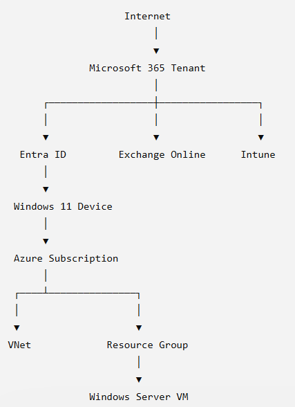

# Enterprise Microsoft 365 + Azure Lab

## Project Overview

## Business Scenario

AjmalTech Ltd is a fictional company with approximately 100 employees.

This lab demonstrates how Microsoft 365, Entra ID, Intune, Azure infrastructure, PowerShell automation, and Terraform can be used to manage a secure enterprise environment.

The objective is to demonstrate practical skills in:

- Microsoft Entra ID
- Conditional Access
- Intune
- Azure Infrastructure
- PowerShell Automation
- Terraform
- Monitoring and Alerting

## Architecture

## Current Progress

### Phase 1
- [x] Repository Created
- [x] Architecture Diagram
- [x] Entra ID Users
- [x] Entra ID Groups
- [ ] Conditional Access Policy

### Phase 2
- [ ] Intune Device Enrollment
- [ ] Compliance Policies
- [ ] Application Deployment

### Phase 3
- [ ] Azure Infrastructure
- [ ] Virtual Network
- [ ] Windows Server VM

### Phase 4
- [ ] PowerShell Automation

### Phase 5
- [ ] Terraform Deployment

## Technologies Used

- Microsoft Entra ID
- Azure
- Intune
- PowerShell
- Terraform
- Windows Server 2022