# Enterprise Microsoft 365 & Azure Lab

> A production-style Infrastructure as Code (IaC) portfolio demonstrating Microsoft Azure, Terraform, GitHub Actions, Azure CLI, Microsoft Entra ID, and enterprise cloud administration.

---


---


# Overview

This repository documents my personal enterprise cloud engineering lab.

The project demonstrates how an existing Microsoft Azure environment can be migrated into Infrastructure as Code using Terraform, securely managed with a remote backend, and automatically validated through GitHub Actions using OpenID Connect (OIDC) authentication.

Rather than creating temporary lab resources, the project focuses on real-world operational practices including:

- Infrastructure as Code (Terraform)
- Modular Terraform architecture
- Azure Resource Manager (ARM)
- Microsoft Entra ID authentication
- Azure CLI administration
- GitHub Actions CI/CD
- Remote Terraform State
- Azure Storage backend
- State locking
- Linux administration
- Secure SSH authentication
- Azure networking
- Enterprise documentation

The objective is to build a portfolio that reflects enterprise cloud engineering practices rather than isolated technical demonstrations.

---

# Project Objectives

The project aims to demonstrate practical experience with:

- Microsoft Azure
- Terraform
- Infrastructure as Code (IaC)
- Microsoft Entra ID
- GitHub Actions
- Azure CLI
- Linux Administration
- Enterprise Networking
- Cloud Security
- DevOps Automation
- Continuous Integration
- Infrastructure Documentation

---

# Current Project Status

| Area | Status |
|-------|--------|
| Azure Infrastructure | ✅ Complete |
| Ubuntu Server Deployment | ✅ Complete |
| Azure CLI | ✅ Complete |
| Terraform Installation | ✅ Complete |
| Existing Infrastructure Imported | ✅ Complete |
| Remote Terraform Backend | ✅ Complete |
| Azure Storage Backend | ✅ Complete |
| State Locking | ✅ Complete |
| GitHub Actions CI | ✅ Complete |
| Azure OIDC Authentication | ✅ Complete |
| Terraform Resource Group Module | ✅ Complete |
| Terraform Networking Module | ✅ Complete |
| Shared Terraform Variables | ✅ Complete |
| Storage Module | ✅ Complete |
| Compute Module | ✅ Complete |
| Documentation | 🚧 Ongoing |

---

# Architecture

```text
                        GitHub Repository
                               │
                               │
                               ▼
                     GitHub Actions Workflow
                               │
                               │
                               ▼
                OpenID Connect (OIDC Authentication)
                               │
                               ▼
                    Microsoft Entra ID Application
                               │
                               ▼
                      Azure Subscription
                               │
          ┌────────────────────┴────────────────────┐
          │                                         │
          ▼                                         ▼
 Remote Terraform State                  Azure Infrastructure
 Azure Storage Account                  Resource Group
 Blob Container                         Virtual Network
 State Locking                          Subnet
                                        Network Security Group
                                        Public IP
                                        Network Interface
                                        Ubuntu Linux VM
```

## Azure Virtual Machine

The Terraform deployment provisions a Linux virtual machine inside Azure which serves as the primary workload for this lab.

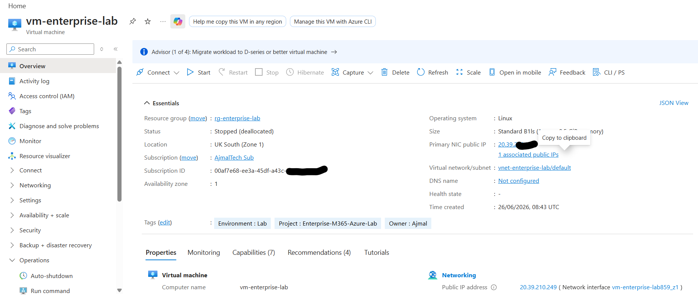

---

# Repository Structure

```text
enterprise-m365-azure-lab/

├── .github/
│   └── workflows/
│       └── terraform.yml
│
├── docs/
│   ├── architecture.md
│   ├── lessons-learned.md
│   └── azure/
│       ├── azure-vm-deployment.md
│       ├── terraform-deployment.md
│       └── terraform-state-management.md
│
├── screenshots/
│
├── terraform/
│   ├── backend.tf
│   ├── providers.tf
│   ├── versions.tf
│   ├── variables.tf
│   ├── outputs.tf
│   ├── terraform.tfvars
│   ├── resource-group.tf
│   ├── networking.tf
│   ├── storage.tf
│   ├── compute.tf
│   │
│   └── modules/
│       ├── resource-group/
│       │   ├── main.tf
│       │   ├── variables.tf
│       │   └── outputs.tf
│       │
│       ├── networking/
│       │   ├── main.tf
│       │   ├── variables.tf
│       │   └── outputs.tf
│       │
│       ├── storage/
│       │   ├── main.tf
│       │   ├── variables.tf
│       │   └── outputs.tf
│       │
│       └── compute/
│           ├── main.tf
│           ├── variables.tf
│           └── outputs.tf
│
├── .gitignore
├── CHANGELOG.md
├── LICENSE
└── README.md
```

## Repository Structure

The project follows a modular Terraform layout designed for scalability and reuse.

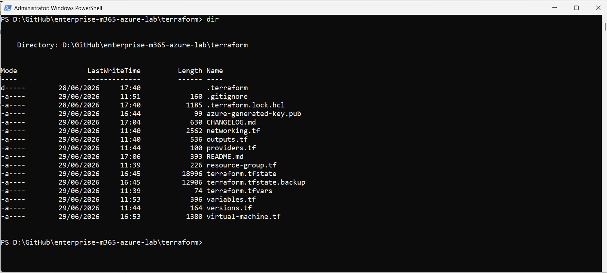

---

# Technologies Used

## Cloud

- Microsoft Azure
- Microsoft Entra ID
- Azure Resource Manager
- Azure Storage
- Azure Virtual Machines
- Azure Virtual Networking

## Infrastructure as Code

- Terraform
- AzureRM Provider
- Remote Backend
- Terraform Modules

## DevOps

- GitHub
- GitHub Actions
- OpenID Connect (OIDC)
- CI/CD

## Operating System

- Ubuntu Server 24.04 LTS

## Administration

- Azure CLI
- SSH
- Git
- PowerShell

---

# Key Features

- Existing Azure infrastructure imported into Terraform
- Modular Infrastructure as Code
- Remote Terraform State
- Azure Blob Storage Backend
- State Locking
- GitHub Actions Automation
- Passwordless Azure Authentication
- Shared Terraform Variables
- Reusable Terraform Modules
- Enterprise Documentation
- Infrastructure Validation
- Infrastructure Version Control

---

# Terraform Modules

The Terraform configuration is being refactored into reusable modules following enterprise best practices.

Current modules:

- Resource Group
- Networking

Planned modules:

- Storage
- Compute
- Monitoring
- Key Vault

Each module contains:

- main.tf
- variables.tf
- outputs.tf

This approach improves:

- Reusability
- Maintainability
- Scalability
- Separation of concerns

---

# Project Timeline

The project has been developed incrementally using enterprise Infrastructure as Code (IaC) practices. Rather than deploying everything from scratch, an existing Azure environment was progressively migrated into Terraform while maintaining full infrastructure availability.

## Phase 1 — Azure Infrastructure

Completed:

- Created Azure Resource Group
- Created Virtual Network
- Created Subnet
- Created Network Security Group
- Created Public IP
- Created Network Interface
- Deployed Ubuntu Server 24.04 LTS
- Configured Trusted Launch
- Enabled Secure Boot
- Enabled vTPM
- Configured SSH authentication

---

## Phase 2 — Linux Administration

Completed:

- Updated Ubuntu
- Installed administration tools
- Installed Azure CLI
- Installed Terraform
- Configured UFW Firewall
- Installed Fail2Ban
- Configured persistent swap
- Verified SSH connectivity

---

## Phase 3 — Infrastructure as Code

Completed:

- Created Terraform project
- Configured AzureRM Provider
- Created Terraform configuration
- Imported existing Azure infrastructure
- Validated imported resources
- Eliminated Terraform drift
- Verified Infrastructure as Code consistency

Imported resources include:

- Resource Group
- Virtual Network
- Subnet
- Network Security Group
- Public IP
- Network Interface
- Ubuntu Linux Virtual Machine

---

## Phase 4 — Remote Terraform Backend

Completed:

- Created Azure Storage Account
- Created Blob Container
- Migrated Terraform state
- Configured Azure Storage backend
- Enabled state locking
- Configured Azure AD authentication

Benefits:

- Centralized Terraform state
- Team collaboration support
- Automatic state locking
- Secure backend
- Enterprise Infrastructure as Code workflow

---

## Phase 5 — GitHub Actions

Completed:

- Created CI workflow
- Automated Terraform validation
- Automated Terraform formatting checks
- Automated Terraform planning
- Configured OpenID Connect (OIDC)
- Removed dependency on stored Azure credentials
- Implemented passwordless Azure authentication

Workflow:

```text
Developer Push
      │
      ▼
GitHub Actions
      │
      ▼
Terraform fmt
      │
      ▼
Terraform init
      │
      ▼
Terraform validate
      │
      ▼
Terraform plan
```

## Continuous Integration

Every push to the **main** branch automatically validates the Terraform configuration using GitHub Actions.

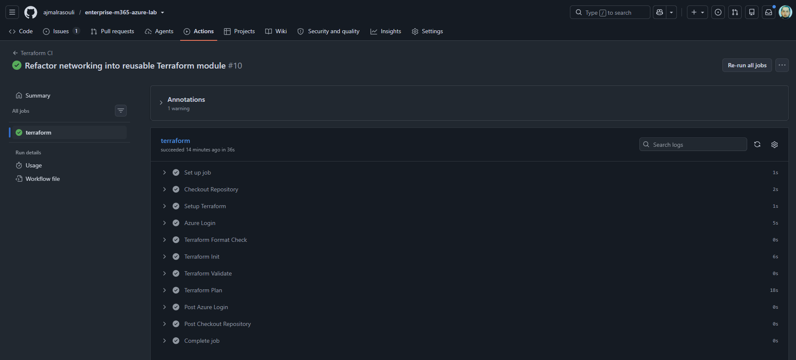


---

# Infrastructure Migration

One of the primary objectives of this project was to migrate manually created Azure resources into Terraform without recreating infrastructure.

The migration process followed these steps:

1. Create Terraform configuration
2. Match Azure resource properties
3. Import existing Azure resources
4. Validate imported state
5. Confirm zero configuration drift
6. Store Terraform state remotely
7. Automate validation through GitHub Actions

This approach ensured that no production resources were recreated during the migration.

---

# Terraform Module Refactoring

The project is being refactored into reusable Terraform modules following enterprise Infrastructure as Code practices.

Completed modules:

- Resource Group
- Networking

The Resource Group module demonstrates:

- Reusable module design
- Input variables
- Output values
- Shared tags
- State migration using `terraform state mv`

The Networking module demonstrates:

- Virtual Network
- Subnet
- Network Security Group
- Public IP
- Network Interface
- Module outputs
- Root module simplification

All module migrations were completed without changing any Azure infrastructure by using Terraform state migration.

---

# Terraform State Migration

During the module refactoring process, Terraform state was moved rather than recreating Azure resources.

Example:

```bash
terraform state mv \
azurerm_resource_group.rg \
module.resource_group.azurerm_resource_group.this
```

Networking resources were migrated using the same approach.

Benefits:

- No infrastructure downtime
- No resource recreation
- No IP address changes
- No service interruption
- Safe Infrastructure as Code refactoring


### Migrating Local State

The Terraform state was migrated from the local backend to Azure Blob Storage.

.png)


---

# Remote Terraform Backend

The project stores Terraform state in Azure Storage.

Configuration includes:

- Azure Storage Account
- Blob Container
- Remote State
- State Locking

Advantages:

- Shared state
- Improved collaboration
- Secure storage
- Automatic locking
- Enterprise Terraform workflow

---

# GitHub Actions CI Pipeline

Every push to the `main` branch automatically performs:

- Checkout repository
- Azure authentication using OpenID Connect
- Terraform initialization
- Terraform formatting validation
- Terraform validation
- Terraform planning

This provides continuous validation of the Infrastructure as Code repository before changes are applied.

---

# Security

The project follows security best practices.

Implemented:

- Passwordless Azure authentication
- Microsoft Entra ID Workload Identity Federation
- OpenID Connect
- Remote Terraform state
- Secure SSH authentication
- Trusted Launch
- Secure Boot
- vTPM
- UFW Firewall
- Fail2Ban
- GitHub Secrets
- Terraform state locking

Sensitive information is never committed to source control.

Ignored files include:

```text
terraform.tfvars
*.tfstate
*.tfstate.*
.azure/
*.pem
*.ppk
azure-generated-key.pub
```

---

# Lessons Learned

This project provided practical experience with:

- Infrastructure as Code migration
- Azure Resource Manager
- Terraform imports
- Terraform state management
- Remote backends
- Azure Storage
- Microsoft Entra ID
- GitHub Actions
- OpenID Connect authentication
- Terraform modules
- Enterprise Infrastructure as Code design
- Cloud networking
- Linux administration

## Lessons Learned – Terraform State Management

During the Storage Module implementation, I encountered an important Terraform state management scenario.

### Problem

Initially, the Terraform backend storage account (`stajmalterraform01`) and the `tfstate` container were managed as Terraform resources. After refactoring the project to use a reusable Storage module, I removed those resources from the Terraform configuration because the backend infrastructure should not be managed by the same Terraform project that depends on it.

When I ran:

```bash
terraform plan
```

Terraform reported:

```text
Plan: 1 to add, 0 to change, 2 to destroy.
```

Terraform planned to destroy:

- `azurerm_storage_account.tfstate`
- `azurerm_storage_container.tfstate`

This happened because the resources still existed in the Terraform state file even though they had been removed from the configuration.

### Solution

Instead of allowing Terraform to delete the Azure resources, I removed them from the Terraform state using:

```bash
terraform state rm azurerm_storage_container.tfstate
terraform state rm azurerm_storage_account.tfstate
```

This removed the resources from Terraform's state while leaving the actual Azure Storage Account and Blob Container untouched.

After running the commands, the execution plan became:

```text
Plan: 1 to add, 0 to change, 0 to destroy.
```

Terraform then created only the new Storage Account managed by the reusable Storage module.

### Key Takeaways

- Terraform state determines what Terraform manages.
- Removing a resource from the configuration does **not** automatically remove it from the state.
- If a resource is removed from the configuration but remains in the state, Terraform assumes it should be destroyed.
- `terraform state rm` removes a resource from Terraform's state **without deleting the actual Azure resource**.
- Backend infrastructure (such as the Terraform state storage account) should be managed separately from the infrastructure that depends on it.
- Understanding Terraform state management is an essential operational skill for Infrastructure as Code and DevOps engineers.


## GitHub Actions and Terraform Variables

### Problem

The GitHub Actions workflow stalled during `terraform plan` and appeared to hang while acquiring the remote state lock.

The workflow output showed:

```text
var.storage_account_name
  Storage Account Name
```

### Root Cause

The required variable `storage_account_name` was stored locally in `terraform.tfvars`.

Since `terraform.tfvars` is excluded from source control (`*.tfvars` in `.gitignore`), GitHub Actions did not receive this value.

Terraform therefore prompted for the missing variable, which caused the non-interactive workflow to wait indefinitely.

### Solution

Created a GitHub Repository Variable:

```

TF_VAR_storage_account_name = ajmaltechlabstore01

```

and referenced it in the workflow:

```yaml
env:
  TF_VAR_storage_account_name: ${{ vars.TF_VAR_storage_account_name }}
```

### Lesson Learned

Do not rely on `terraform.tfvars` in CI/CD pipelines.

Use:

- GitHub Repository Variables for non-sensitive values.
- GitHub Secrets for sensitive values.


# Terraform Project Structure

The Terraform configuration has been organised following enterprise Infrastructure as Code practices.

```text
terraform/

├── backend.tf
├── providers.tf
├── versions.tf
├── variables.tf
├── outputs.tf
├── resource-group.tf
├── networking.tf
├── storage.tf
├── virtual-machine.tf
├── terraform.tfvars
│
└── modules/
    ├── resource-group/
    │   ├── main.tf
    │   ├── variables.tf
    │   └── outputs.tf
    │
    └── networking/
        ├── main.tf
        ├── variables.tf
        └── outputs.tf
```

The modular design improves:

- Code reuse
- Maintainability
- Scalability
- Separation of concerns
- Easier collaboration
- Enterprise readiness

Future modules will include:

- Storage
- Compute
- Monitoring
- Key Vault

---

# Azure Resources

The current environment is composed of the following Azure resources.

## Resource Group

- Azure Resource Group
- Central location for all lab resources

## Networking

- Virtual Network
- Subnet
- Network Security Group
- Static Public IP
- Network Interface

## Compute

- Ubuntu Server 24.04 LTS
- Trusted Launch
- Secure Boot
- vTPM
- SSH Authentication

## Storage

- Azure Storage Account
- Blob Container
- Remote Terraform Backend


## Remote Terraform State

Terraform state is stored securely inside an Azure Storage Account using an Azure Blob container.

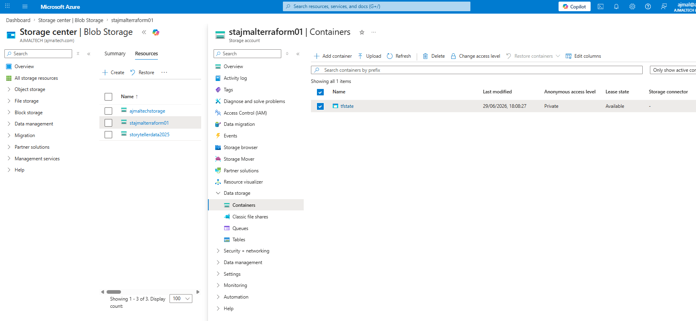


---

# Infrastructure Validation

Every infrastructure change follows the same validation process.

```bash
terraform fmt
terraform validate
terraform plan
```

The objective is always:

```text
No changes.
Your infrastructure matches the configuration.
```

This ensures Terraform configuration accurately represents the deployed Azure infrastructure.

### Terraform Initialization

Terraform initializes the AzureRM provider, downloads required plugins and configures the remote backend.

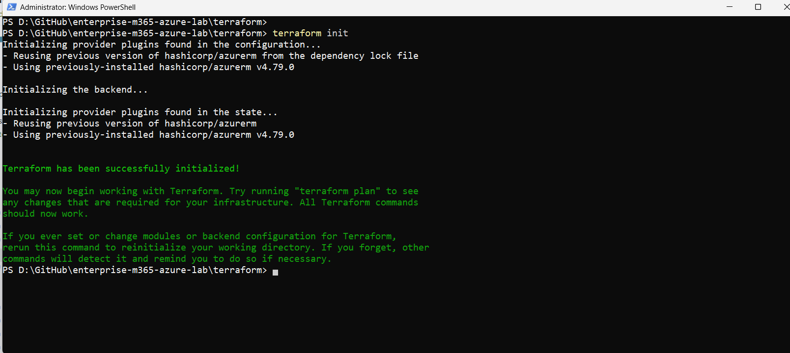


### Terraform Validation

Terraform formatting and validation ensure configuration quality before deployment.

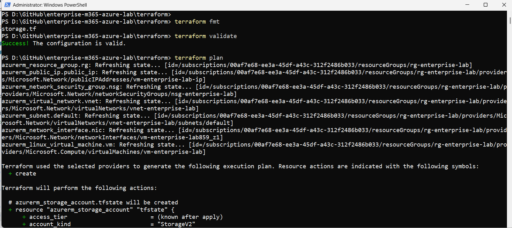


### Terraform Planning

Terraform compares the desired configuration against the current Azure infrastructure before making changes.

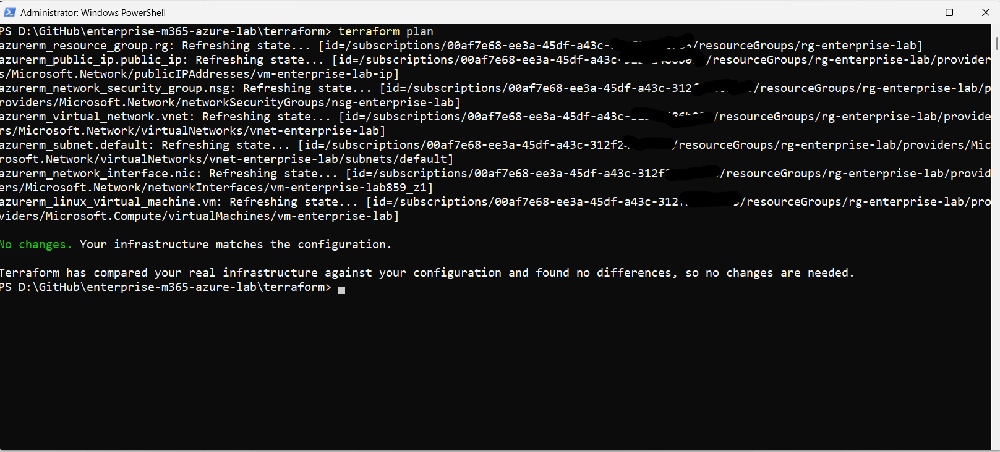


### Deploy Storage Resources

Terraform creates the Azure Storage Account and Blob Container.

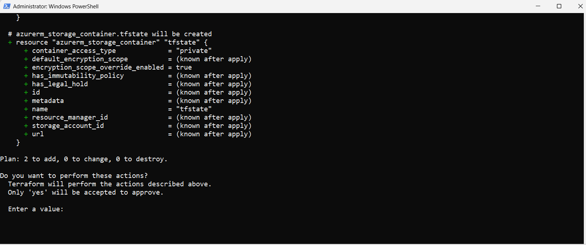

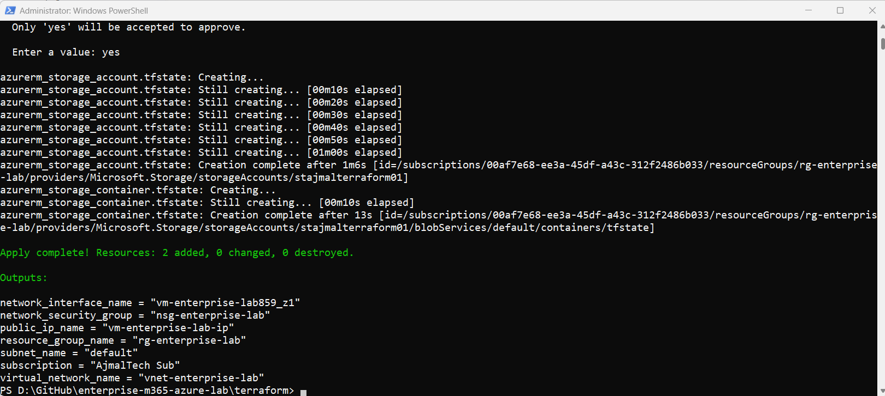

## Terraform State

Current Terraform-managed resources can be inspected using the Terraform state commands.

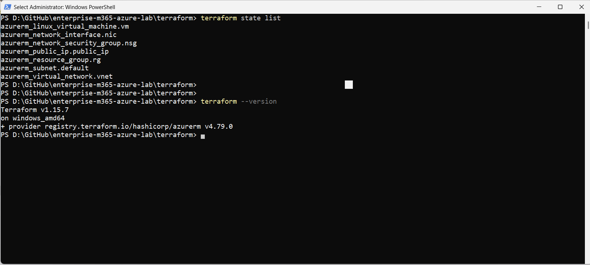
---

# GitHub Actions

Infrastructure validation is automated through GitHub Actions.

Workflow stages:

```text
Developer

↓

Git Push

↓

GitHub Repository

↓

GitHub Actions

↓

Azure Login (OIDC)

↓

Terraform Init

↓

Terraform Validate

↓

Terraform Plan

↓

Success
```

Pipeline features include:

- Automatic execution
- Infrastructure validation
- Terraform formatting checks
- Azure authentication
- Remote backend access
- State locking
- Infrastructure planning

No Azure credentials are stored in GitHub.

Authentication uses:

- Microsoft Entra ID
- OpenID Connect
- Federated Credentials

---

# Azure Authentication

Authentication is performed using Microsoft Entra ID Workload Identity Federation.

Advantages include:

- Passwordless authentication
- No Service Principal secrets
- Short-lived access tokens
- Improved security
- Enterprise best practices

Authentication flow:

```text
GitHub Actions

↓

OIDC Token

↓

Microsoft Entra ID

↓

Azure Subscription

↓

Terraform
```
## Azure Cost Management

Azure Cost Management is used to monitor resource usage and estimate project costs.

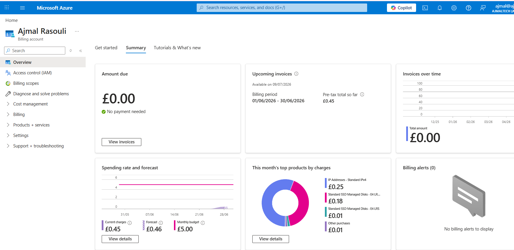


## GitHub OIDC Authentication

GitHub Actions authenticates to Azure using Microsoft Entra ID and OpenID Connect (OIDC), eliminating the need to store Azure credentials in GitHub secrets.

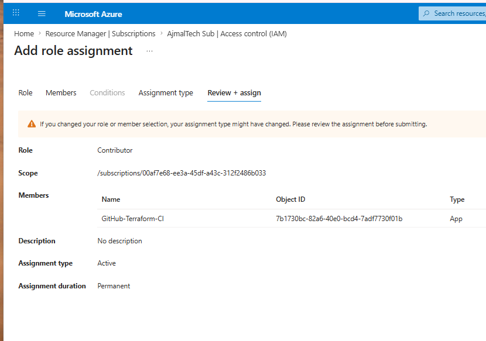

---

# Remote State

Terraform state is stored remotely.

Configuration includes:

- Azure Storage Account
- Blob Container
- AzureRM Backend

Features:

- Centralized state
- Team collaboration
- State locking
- Secure storage
- Version control integration


### Verify Remote State

The Terraform state file can be verified directly in the Azure Portal.

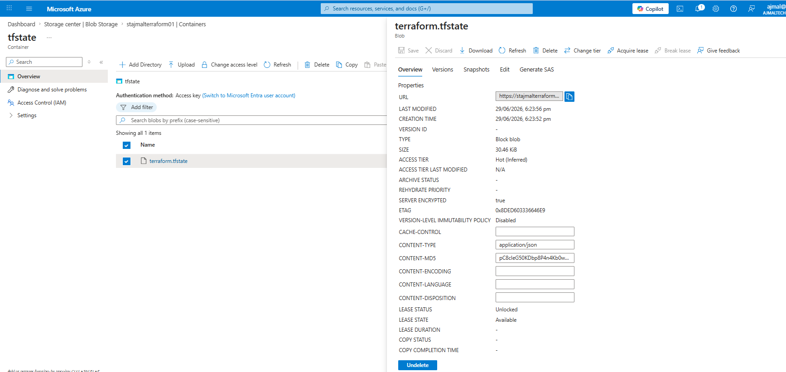

---

# Repository Documentation

Project documentation is organised as follows.

```text
docs/

├── architecture.md
│
└── azure/
    ├── azure-vm-deployment.md
    └── terraform-deployment.md
```

Documentation includes:

- Azure deployment
- Terraform implementation
- Architecture
- Infrastructure design
- Operational procedures
- Screenshots

---

# Screenshots

The repository includes screenshots demonstrating the deployment and configuration process.

Examples include:

- Azure Resource Group
- Virtual Network
- Ubuntu Server
- Azure CLI
- Terraform Installation
- Terraform Import
- Terraform State Migration
- GitHub Actions
- Azure Storage Backend
- Remote State
- Successful Terraform Plan
- Linux Administration

---

# Skills Demonstrated

This project demonstrates practical experience with:

## Microsoft Azure

- Azure Resource Manager
- Virtual Networks
- Virtual Machines
- Storage Accounts
- Network Security Groups
- Public IP
- Resource Groups

## Terraform

- Infrastructure as Code
- Terraform Modules
- Resource Imports
- State Migration
- Remote Backend
- State Locking
- Variables
- Outputs
- Providers

## DevOps

- Git
- GitHub
- GitHub Actions
- Continuous Integration
- Infrastructure Validation
- Version Control

## Identity & Security

- Microsoft Entra ID
- OpenID Connect
- Federated Credentials
- Azure RBAC
- Secure SSH Authentication
- Trusted Launch
- Secure Boot
- vTPM

## Linux Administration

- Ubuntu Server
- Azure CLI
- SSH
- UFW Firewall
- Fail2Ban
- Package Management
- Swap Configuration

---

# Project Highlights

✔ Existing Azure infrastructure imported into Terraform

✔ Remote Terraform backend configured

✔ Azure Storage state locking enabled

✔ GitHub Actions CI pipeline implemented

✔ Passwordless Azure authentication using OpenID Connect

✔ Terraform state migrated safely

✔ Resource Group refactored into reusable module

✔ Networking refactored into reusable module

✔ Shared Terraform variables implemented

✔ Infrastructure validated with zero configuration drift

✔ Enterprise documentation maintained throughout the project

## Project Management

Development progress is tracked using GitHub Projects.

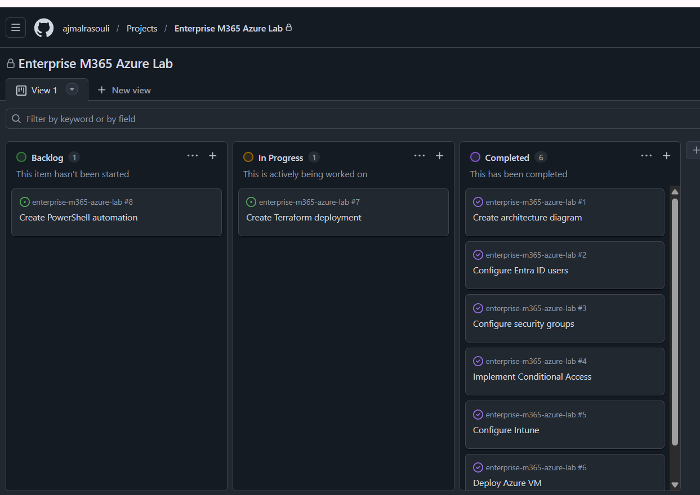

---

# Design Principles

This project follows several engineering principles.

- Infrastructure as Code
- Security by Default
- Modular Design
- Automation First
- Reusable Components
- Documentation Driven
- Incremental Refactoring
- Zero Downtime Infrastructure Migration
- Version Controlled Infrastructure
- Enterprise Maintainability

---

# Future Roadmap

The project will continue to evolve following enterprise Infrastructure as Code and Microsoft Cloud engineering best practices.

## Terraform

- Complete Storage Module
- Complete Compute Module
- Create Monitoring Module
- Create Key Vault Module
- Implement Diagnostic Settings
- Introduce Terraform Workspaces
- Add Environment Separation (Dev / Test / Production)

---

## Azure

Planned Azure services include:

- Azure Key Vault
- Azure Monitor
- Log Analytics Workspace
- Azure Bastion
- Azure Backup
- Azure Update Manager
- Azure Policy
- Azure Automation
- Azure Recovery Services Vault

---

## Microsoft 365

Future Microsoft 365 administration scenarios will include:

- Microsoft Entra ID
- Conditional Access
- Identity Governance
- Privileged Identity Management (PIM)
- Microsoft Intune
- Device Compliance Policies
- Windows Autopilot
- Microsoft Defender for Endpoint
- Microsoft Purview
- Microsoft Sentinel

---

## DevOps

Future automation work includes:

- Multi-stage GitHub Actions pipelines
- Pull Request validation
- Terraform Apply workflow
- Manual approvals
- Automated documentation generation
- Release automation
- Terraform testing
- Security scanning
- Cost analysis

---

# Learning Outcomes

This project has provided hands-on experience with:

- Designing Azure infrastructure
- Deploying Infrastructure as Code
- Importing existing Azure resources into Terraform
- Managing Terraform state
- Migrating state safely using `terraform state mv`
- Configuring remote Terraform backends
- Azure Storage state locking
- Microsoft Entra ID authentication
- GitHub Actions automation
- OpenID Connect (OIDC)
- Terraform module design
- Linux administration
- Azure networking
- Enterprise documentation

---

# Certifications Supporting This Project

The practical work in this repository complements the following Microsoft and cloud certifications.

## Microsoft

- Microsoft Certified: Azure Administrator Associate (AZ-104)
- Microsoft Certified: Azure AI Engineer Associate
- Microsoft Certified: Identity and Access Administrator Associate (SC-300)
- Microsoft Azure Fundamentals (AZ-900)
- Microsoft Azure AI Fundamentals (AI-900)
- Microsoft Azure Data Fundamentals (DP-900)
- Microsoft 365 Fundamentals (MS-900)
- Microsoft Power Platform Fundamentals (PL-900)

---

## AWS

- AWS Certified Solutions Architect – Associate
- AWS Certified Cloud Practitioner

---

## Google

- Professional Chrome Enterprise Administrator

---

## HashiCorp

- Terraform Associate (003)

---

# References

Useful Microsoft and HashiCorp documentation used throughout this project.

## Microsoft Learn

- Azure Virtual Machines
- Azure Virtual Networks
- Azure Storage
- Microsoft Entra ID
- Azure CLI
- Azure RBAC
- Azure Resource Manager

## Terraform

- Terraform Language
- AzureRM Provider
- Terraform State
- Terraform Modules
- Terraform Backend
- Terraform Import
- Terraform State Migration

---

## Project Overview

This repository demonstrates the design, deployment, automation, and management of enterprise cloud infrastructure using Infrastructure as Code (IaC) and scripting.

The project focuses on building production-style skills across Microsoft Azure, Terraform, GitHub Actions, and PowerShell automation.

### Technologies

- Microsoft Azure
- Terraform
- GitHub Actions
- PowerShell
- Azure CLI
- Git
- GitHub

## Features

### Infrastructure as Code

- Azure Resource Group
- Virtual Network
- Subnet
- Network Security Group
- Public IP Address
- Linux Virtual Machine
- Azure Storage Account
- Remote Terraform State

### Terraform

- Modular architecture
- Remote backend
- State management
- Reusable modules
- Outputs and variables
- Enterprise repository structure

### CI/CD

- GitHub Actions
- OIDC authentication
- Terraform validation
- Terraform formatting checks
- Terraform plan generation
- Plan artifact upload

### PowerShell Automation

- System Information Reporting
- Logging
- CSV reporting
- Error handling
- Enterprise script structure

## Repository Structure

```text
enterprise-m365-azure-lab/

├── .github/
│   └── workflows/
│       └── terraform.yml
│
├── docs/
│   ├── architecture.md
│   ├── lessons-learned.md
│   └── azure/
│
├── powershell/
│   ├── scripts/
│   │   └── Get-SystemReport.ps1
│   ├── reports/
│   ├── logs/
│   └── README.md
│
├── screenshots/
│
├── terraform/
│   ├── backend.tf
│   ├── providers.tf
│   ├── versions.tf
│   ├── variables.tf
│   ├── outputs.tf
│   ├── resource-group.tf
│   ├── networking.tf
│   ├── storage.tf
│   ├── compute.tf
│   ├── terraform.tfvars
│   │
│   └── modules/
│       ├── resource-group/
│       ├── networking/
│       ├── storage/
│       └── compute/
│
├── CHANGELOG.md
├── LICENSE
└── README.md
```


## Project Roadmap

### Phase 1 – Azure Infrastructure
- ✅ Resource Group
- ✅ Virtual Network
- ✅ Subnet
- ✅ Network Security Group
- ✅ Public IP

### Phase 2 – Compute
- ✅ Linux Virtual Machine

### Phase 3 – Terraform Fundamentals
- ✅ Infrastructure as Code
- ✅ Variables
- ✅ Outputs

### Phase 4 – Remote State
- ✅ Azure Storage Backend
- ✅ State Management

### Phase 5 – Terraform Modules
- ✅ Resource Group Module
- ✅ Networking Module
- ✅ Storage Module
- ✅ Compute Module

### Phase 6 – CI/CD
- ✅ GitHub Actions
- ✅ OIDC Authentication
- ✅ Terraform Validation
- ✅ Terraform Plan
- ✅ GitHub Variables & Secrets

### Phase 7 – PowerShell Automation
- ✅ Lesson 1 – System Information Report
- ⏳ File & Folder Automation
- ⏳ Azure Automation
- ⏳ Microsoft 365 Automation
- ⏳ Reporting

## Recent Lessons Learned

- Successfully migrated Terraform resources into reusable modules using `terraform state mv`.
- Removed backend resources from Terraform state without deleting Azure resources using `terraform state rm`.
- Diagnosed a GitHub Actions issue caused by missing Terraform variables.
- Learned to use GitHub Repository Variables for non-sensitive Terraform inputs and GitHub Secrets for sensitive values.
- Implemented GitHub Actions with OIDC authentication for Azure.


---


# Contributing

This repository is primarily a personal learning and portfolio project.

Suggestions, improvements and constructive feedback are always welcome.

Potential future contributions include:

- Additional Terraform modules
- Documentation improvements
- Architecture diagrams
- Automation enhancements
- GitHub Actions improvements

---

# Repository Statistics

Current implementation includes:

- Azure Infrastructure
- Remote Terraform Backend
- GitHub Actions CI
- Azure OIDC Authentication
- Enterprise Documentation
- Terraform Modules
- Infrastructure Imports
- Linux Administration
- Azure CLI Automation

Project metrics continue to grow as additional Azure services and Microsoft 365 workloads are implemented.

---

# License

This project is licensed under the MIT License.

See the `LICENSE` file for details.

---

# Author

**Ajmal Rasouli**

Technical Engineer | Cloud Computing | Infrastructure Management

Specialising in:

- Microsoft Azure
- Microsoft 365
- Microsoft Entra ID
- Terraform
- Infrastructure as Code
- Azure Networking
- Linux Administration
- GitHub Actions
- DevOps Automation

---

# Project Summary

This repository demonstrates the practical implementation of enterprise cloud engineering practices using Microsoft Azure, Terraform and GitHub Actions.

Highlights include:

- Azure infrastructure deployed and managed using Infrastructure as Code
- Existing Azure resources imported into Terraform
- Remote Terraform backend using Azure Storage
- State locking for collaborative Infrastructure as Code
- Passwordless Azure authentication using Microsoft Entra ID and OpenID Connect
- Automated validation through GitHub Actions
- Modular Terraform architecture
- Zero-drift infrastructure validation
- Enterprise documentation maintained throughout the project lifecycle

The project continues to evolve with additional Azure services, Microsoft 365 administration scenarios and DevOps automation, providing a realistic representation of modern cloud engineering practices.

---

**Last Updated:** June 2026

**Status:** Active Development 🚀
