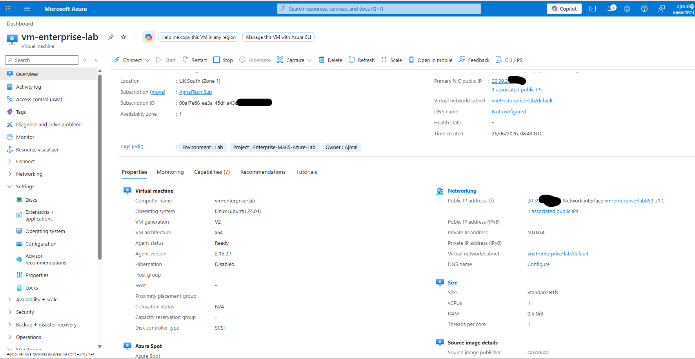
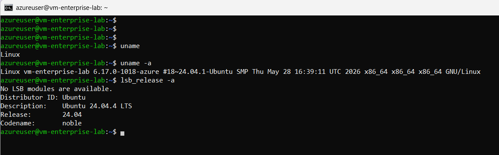
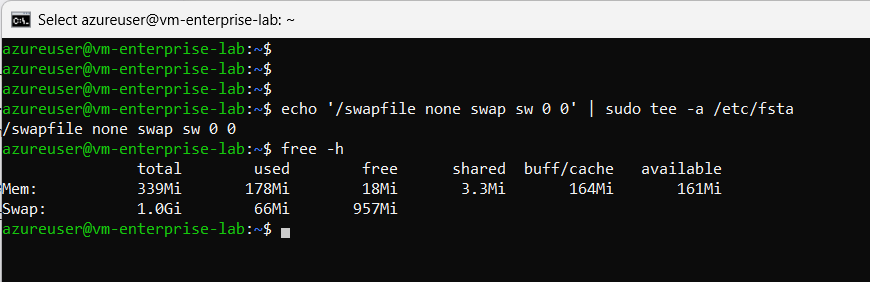
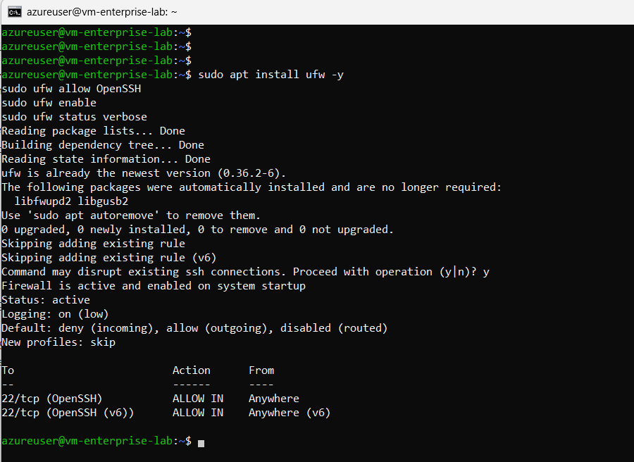
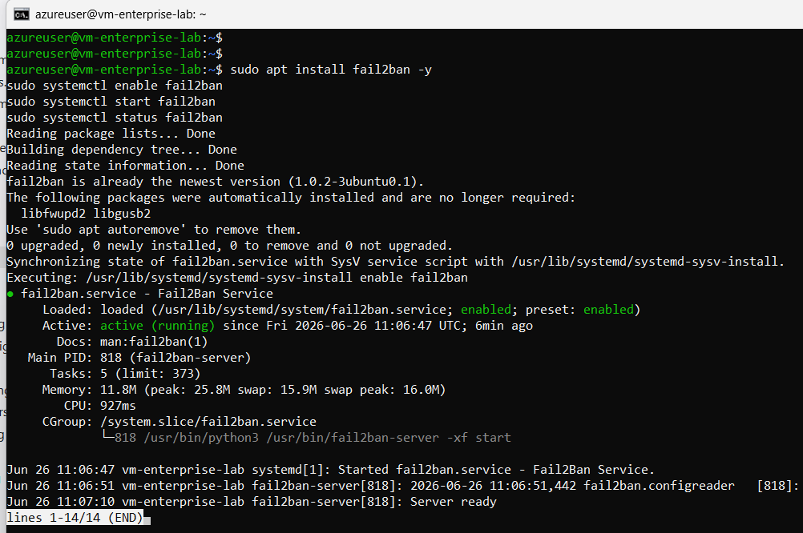
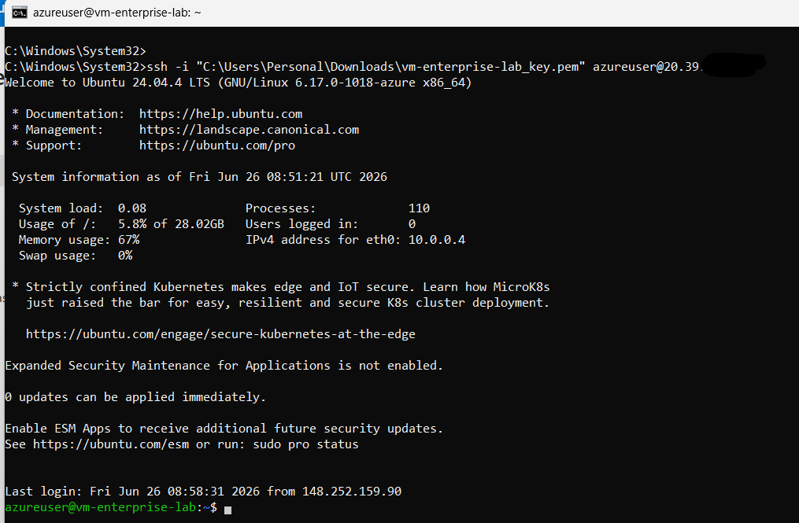
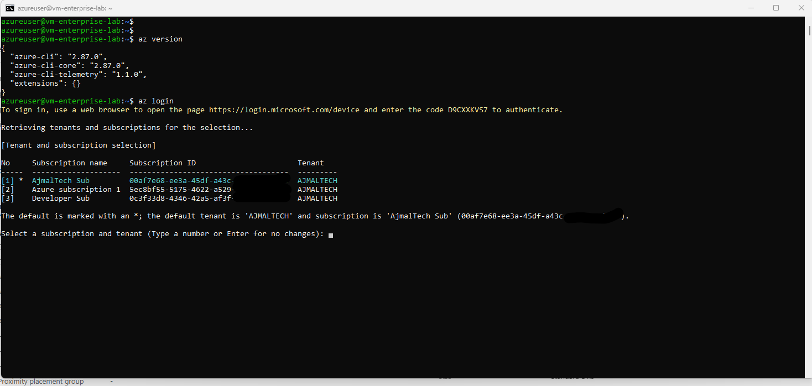
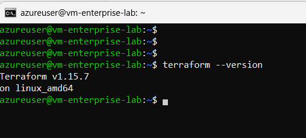

# Azure Virtual Machine Deployment

## Overview

This document describes the deployment and configuration of the Ubuntu Linux virtual machine used throughout the Enterprise M365 Azure Lab.

The VM serves as a Linux administration environment for Azure CLI, Terraform, Infrastructure as Code (IaC), and future automation projects.

> **Repository:** https://github.com/ajmalrasouli/enterprise-m365-azure-lab
---

# Azure Infrastructure

The following Azure resources were deployed:

- ✅ Resource Group
- ✅ Virtual Network
- ✅ Network Security Group
- ✅ Ubuntu Server 24.04 LTS
- ✅ Public IP
- ✅ SSH Key Authentication
- ✅ Auto Shutdown
- ✅ Cost Optimized B1ls VM




## Commands Executed

Although the infrastructure was deployed primarily through the Azure Portal, verification was performed from the Linux VM using Azure CLI.

Login to Azure:

```bash
az login
```

Verify subscription:

```bash
az account show
```

List resource groups:

```bash
az group list -o table
```

List virtual machines:

```bash
az vm list -o table
```

List virtual networks:

```bash
az network vnet list -o table
```

List network security groups:

```bash
az network nsg list -o table
```

---

# Linux Administration

Completed Linux administration tasks:

- ✅ Updated Ubuntu
- ✅ Installed administration tools
- ✅ Added 1 GB persistent swap
- ✅ Configured UFW Firewall
- ✅ Installed Fail2Ban
- ✅ Verified SSH connectivity

## Commands Executed

### Verify Operating System

```bash
lsb_release -a
hostnamectl
uname -a
```



### Update Ubuntu

```bash
sudo apt update
sudo apt upgrade -y
sudo apt autoremove -y
```

### Install Administration Tools

```bash
sudo apt install -y \
curl \
wget \
git \
unzip \
tree \
htop \
net-tools
```

### Configure Swap

```bash
sudo fallocate -l 1G /swapfile
sudo chmod 600 /swapfile
sudo mkswap /swapfile
sudo swapon /swapfile
echo '/swapfile none swap sw 0 0' | sudo tee -a /etc/fstab
```



Verify:

```bash
free -h
swapon --show
```

### Configure UFW

```bash
sudo apt install ufw -y
sudo ufw allow OpenSSH
sudo ufw enable
sudo ufw status verbose
```




### Install Fail2Ban

```bash
sudo apt install fail2ban -y
sudo systemctl enable fail2ban
sudo systemctl start fail2ban
sudo systemctl status fail2ban
```



### Verify Server

```bash
whoami
hostname
df -h
free -h
```



---

# Azure CLI

Azure CLI was installed to allow management of Azure resources directly from the Linux VM.

Completed:

- ✅ Azure CLI Installed
- ✅ Azure Login
- ✅ Subscription Verification
- ✅ Resource Group Enumeration
- ✅ Virtual Machine Enumeration

## Commands Executed

Install Azure CLI:

```bash
curl -sL https://aka.ms/InstallAzureCLIDeb | sudo bash
```

Verify:

```bash
az version
```

Login:

```bash
az login
```

Check current subscription:

```bash
az account show
```

List subscriptions:

```bash
az account list -o table
```

List resource groups:

```bash
az group list -o table
```

List virtual machines:

```bash
az vm list -o table
```

List locations:

```bash
az account list-locations -o table
```




---

# Terraform

Terraform was installed in preparation for Infrastructure as Code deployments.

Completed:

- ✅ Terraform Installed
- ✅ Installation Verified

## Commands Executed

Add HashiCorp repository:

```bash
wget -O- https://apt.releases.hashicorp.com/gpg \
| sudo gpg --dearmor \
-o /usr/share/keyrings/hashicorp-archive-keyring.gpg
```

```bash
echo "deb [signed-by=/usr/share/keyrings/hashicorp-archive-keyring.gpg] \
https://apt.releases.hashicorp.com \
$(lsb_release -cs) main" \
| sudo tee /etc/apt/sources.list.d/hashicorp.list
```




Update packages:

```bash
sudo apt update
```

Install Terraform:

```bash
sudo apt install terraform -y
```

Verify:

```bash
terraform version
```

---

# Current Environment

| Component | Status |
|-----------|--------|
| Ubuntu Server 24.04 | ✅ Running |
| Azure VM | ✅ Running |
| SSH Access | ✅ Working |
| Azure CLI | ✅ Installed |
| Terraform | ✅ Installed |
| UFW Firewall | ✅ Enabled |
| Fail2Ban | ✅ Enabled |
| 1 GB Swap | ✅ Configured |
| Auto Shutdown | ✅ Enabled |

---

# Screenshots Included

| Screenshot | Description |
|------------|-------------|
| azure-vm-created.png | Azure VM deployed successfully |
| ssh-login.png | Successful SSH connection to the Linux VM |
| ubuntu-version.png | Ubuntu Server 24.04 LTS verification |
| swap-enabled.png | Persistent 1 GB swap configured |
| ufw-status.png | UFW firewall enabled |
| fail2ban-status.png | Fail2Ban service running |
| azure-cli-login.png | Azure CLI authentication |
| az-vm-list.png | Azure CLI listing virtual machines |
| terraform-version.png | Terraform installation verified |

---

# Skills Demonstrated

- Microsoft Azure
- Azure Virtual Machines
- Linux Administration
- Ubuntu Server
- SSH
- Azure CLI
- Terraform
- Infrastructure as Code
- Networking
- System Hardening
- Firewall Configuration
- Fail2Ban
- Cost Optimization

---

# Repository Structure

enterprise-m365-azure-lab/
│
├── docs/
│ ├── azure-vm-deployment.md
│ ├── conditional-access.md
│ ├── compliance-policies.md
│ ├── intune-device-enrollment.md
│ └── application-deployment.md
│
├── diagrams/
├── screenshots/
├── terraform/
├── powershell/
└── README.md

---

# Next Steps

The next phase of the project includes:

- Deploy Azure infrastructure using Terraform
- Create reusable Terraform modules
- Store Terraform state securely
- Automate deployments
- Integrate GitHub Actions
- Build PowerShell automation


---

# Project Status

| Project Phase | Status |
|---------------|--------|
| Architecture Design | ✅ Complete |
| Microsoft Entra ID | ✅ Complete |
| Security Groups | ✅ Complete |
| Conditional Access | ✅ Complete |
| Microsoft Intune | ✅ Complete |
| Application Deployment | ✅ Complete |
| Azure Infrastructure | ✅ Complete |
| Linux Administration | ✅ Complete |
| Azure CLI | ✅ Complete |
| Terraform Installation | ✅ Complete |
| Terraform Infrastructure Deployment | 🚧 In Progress |
| PowerShell Automation | 📋 Planned |
| GitHub Actions | 📋 Planned |

# Infrastructure as Code Migration

The manually deployed Azure infrastructure was successfully migrated into Terraform without recreating any resources.

Terraform now manages:

- Resource Group
- Virtual Network
- Subnet
- Network Security Group
- Public IP
- Network Interface
- Ubuntu Linux Virtual Machine

The migration process included importing each Azure resource into Terraform state and validating that the Terraform configuration exactly matched the deployed infrastructure.

Final validation confirmed:
