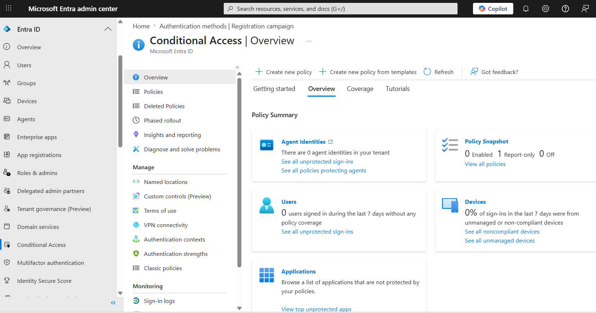
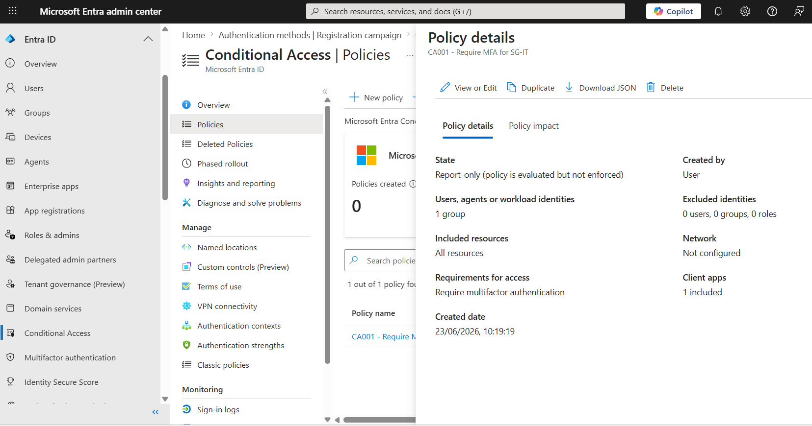
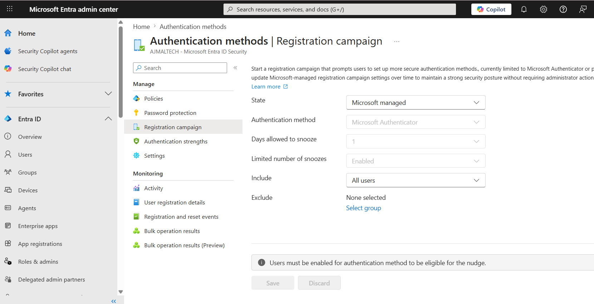

# Conditional Access Configuration

## Objective

Implement a Conditional Access policy to require multifactor authentication (MFA) for IT users and demonstrate Zero Trust security principles using Microsoft Entra ID.

---

## Environment

| Component | Value |
|------------|--------|
| Identity Platform | Microsoft Entra ID P2 |
| Policy Name | CA001 - Require MFA for SG-IT |
| Target Group | SG-IT |
| Target Resources | All Resources |
| Access Control | Require Multifactor Authentication (MFA) |
| Policy State | Report-only |

---

## Security Groups

| Group | Purpose |
|---------|---------|
| SG-IT | IT Department Users |
| SG-HR | Human Resources Users |
| SG-Finance | Finance Department Users |

---

## Policy Configuration

### Users

**Included:**

- SG-IT

**Excluded:**

- None

### Target Resources

- All Resources (formerly All Cloud Apps)

### Conditions

No additional conditions configured.

The following were left at default settings:

- Device Platforms
- Locations
- Client Applications
- Sign-in Risk
- User Risk

### Access Controls

**Grant Access:**

- Require Multifactor Authentication (MFA)

**Operator:**

- Require one of the selected controls

### Policy State

**Report-only**

The policy was configured in Report-only mode to validate expected behavior before enforcing access controls.

---

## Testing

### Test User

**John Smith**

Group Membership:

- SG-IT

### Test Procedure

1. Sign in using the John Smith account.
2. Access Microsoft 365 resources.
3. Review Conditional Access evaluation results.
4. Verify policy targeting and authentication behavior.

### Results

The user was prompted to configure multifactor authentication during sign-in.

Further investigation confirmed that the MFA prompt was not generated by the Conditional Access policy because the policy was configured in Report-only mode.

---

## Investigation Findings

### Authentication Methods Registration Campaign

The tenant contains a Microsoft-managed Authentication Methods Registration Campaign with the following configuration:

| Setting | Value |
|-----------|---------|
| State | Microsoft Managed |
| Included Users | All Users |
| Excluded Users | None |

This registration campaign can prompt users to register stronger authentication methods during sign-in.

### Conclusion

The MFA registration prompt observed during testing was most likely generated by the Microsoft-managed Authentication Methods Registration Campaign rather than the Conditional Access policy itself.

This demonstrates the importance of validating security controls and understanding how multiple Microsoft Entra security features interact.

---

## Screenshots

### Conditional Access Policy Overview

### Policy Details

### Authentication Methods Registration Campaign

---

## Lessons Learned

- Conditional Access policies configured in Report-only mode do not enforce access controls.
- Authentication Methods Registration Campaigns can prompt users to register MFA independently of Conditional Access.
- Security validation should include sign-in logs and policy evaluation results.
- Report-only mode is useful for testing and reducing deployment risk before enforcing policies.

---

## Outcome

Successfully implemented and validated a Conditional Access policy targeting IT users.

### Skills Demonstrated

- Conditional Access Policy Creation
- Group-Based Policy Assignment
- Multifactor Authentication Controls
- Security Validation and Troubleshooting
- Microsoft Entra ID Security Administration
- Zero Trust Security Principles