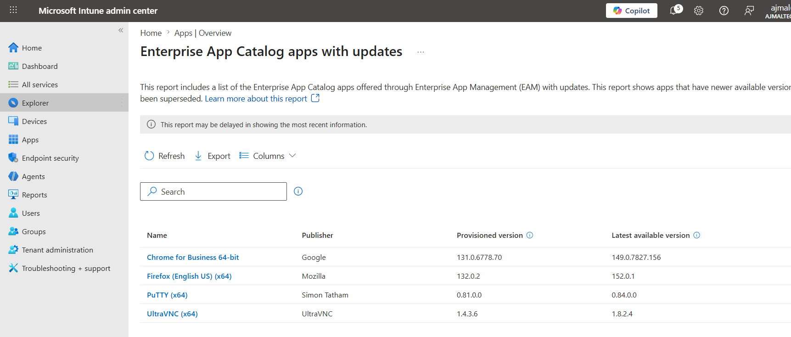
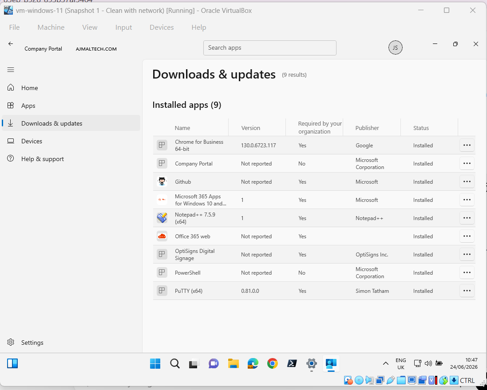
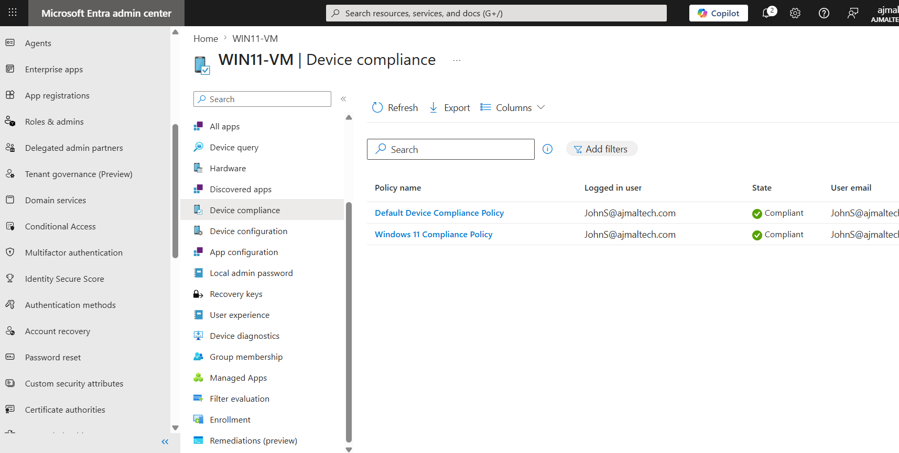

# Application Deployment with Microsoft Intune

## Objective

Deploy applications to managed Windows devices using Microsoft Intune and verify successful installation on enrolled devices.

---

## Environment

| Component | Value |
|------------|------------|
| Platform | Microsoft Intune |
| Device | WIN11-VM |
| Operating System | Windows 11 Pro |
| User | John Smith |
| Group | SG-IT |

---

## Applications Deployed

| Application | Publisher |
|------------|------------|
| Chrome for Business 64-bit | Google |
| Firefox (x64) | Mozilla |
| PuTTY (x64) | Simon Tatham |
| UltraVNC (x64) | UltraVNC |
| GitHub | Microsoft |
| Notepad++ | Notepad++ |

---

## Deployment Process

### Create Application

1. Open Microsoft Intune Admin Center.
2. Navigate to Apps > Windows.
3. Select Add.
4. Choose Microsoft Store app (new).
5. Search for the required application.
6. Configure application settings.
7. Assign the application to the target security group.

### Assignment

| Assignment Type | Target |
|-----------------|----------|
| Required | SG-IT |

---

## Verification

### Intune Admin Center

Applications were successfully deployed and available to assigned devices.

### Company Portal

The enrolled Windows 11 device received and installed assigned applications automatically.

### Installed Applications

Verified installed applications:

- Chrome for Business 64-bit
- GitHub
- Notepad++
- PuTTY (x64)
- Microsoft 365 Apps
- Office 365 Web

---

## Outcome

Successfully deployed applications through Microsoft Intune using centralized application management.

The Windows 11 test device received required applications and reported successful installation status.

---

## Screenshots

### Application Catalog

### Company Portal Installed Applications

### Device Overview

