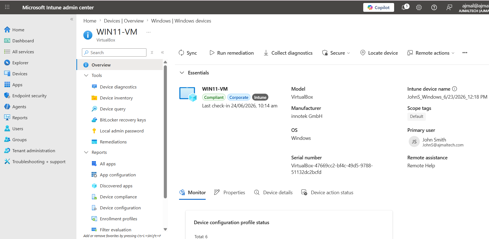
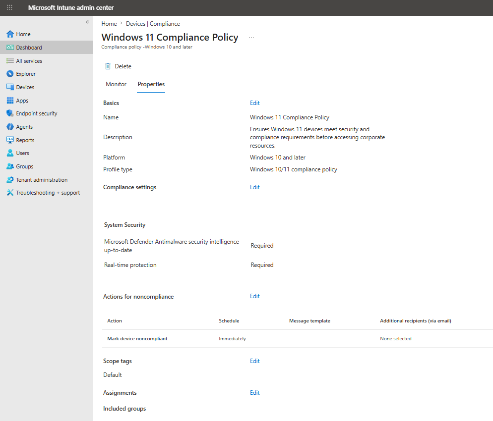
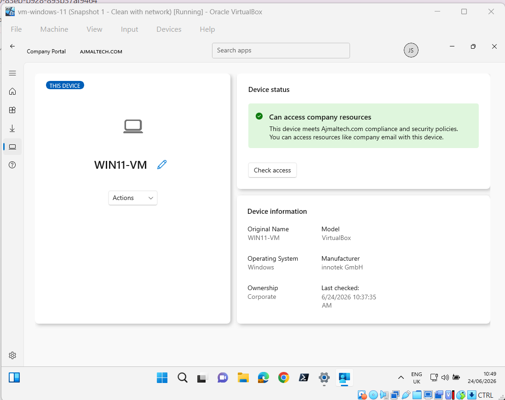

# Configure Compliance Policies

## Objective

Create and deploy a Windows 11 compliance policy using Microsoft Intune to ensure managed devices meet security requirements before accessing organizational resources.

---

## Environment

| Component | Value |
|------------|------------|
| Platform | Microsoft Intune |
| Device | WIN11-VM |
| Operating System | Windows 11 Pro |
| User | John Smith |
| Group | SG-IT |

---

## Compliance Policy Configuration

### Policy Details

| Setting | Value |
|----------|----------|
| Policy Name | Windows 11 Compliance Policy |
| Platform | Windows 10 and later |
| Profile Type | Windows 10/11 Compliance Policy |

### System Security Requirements

| Setting | Requirement |
|----------|----------|
| Microsoft Defender Security Intelligence Up-to-Date | Required |
| Real-Time Protection | Required |

### Actions for Noncompliance

| Action | Schedule |
|----------|----------|
| Mark Device Noncompliant | Immediately |

---

## Assignment

The compliance policy was assigned to the following group:

| Group |
|---------|
| SG-IT |

---

## Testing

After the policy was assigned, Intune evaluated the enrolled Windows 11 virtual machine against the configured requirements.

The device successfully met the following requirements:

- Microsoft Defender security intelligence was current
- Real-time protection was enabled

---

## Verification

### Intune Compliance Policy

The policy was successfully deployed and assigned.

### Device Compliance Status

The enrolled device reported a compliant state.

### Company Portal

The device displayed a compliant status within Company Portal.

---

## Outcome

Successfully implemented a Windows 11 compliance policy using Microsoft Intune.

The enrolled device met all configured compliance requirements and was marked compliant by Intune.

---

## Screenshots

### Managed Device Overview

### Windows 11 Compliance Policy

### Company Portal Compliance

