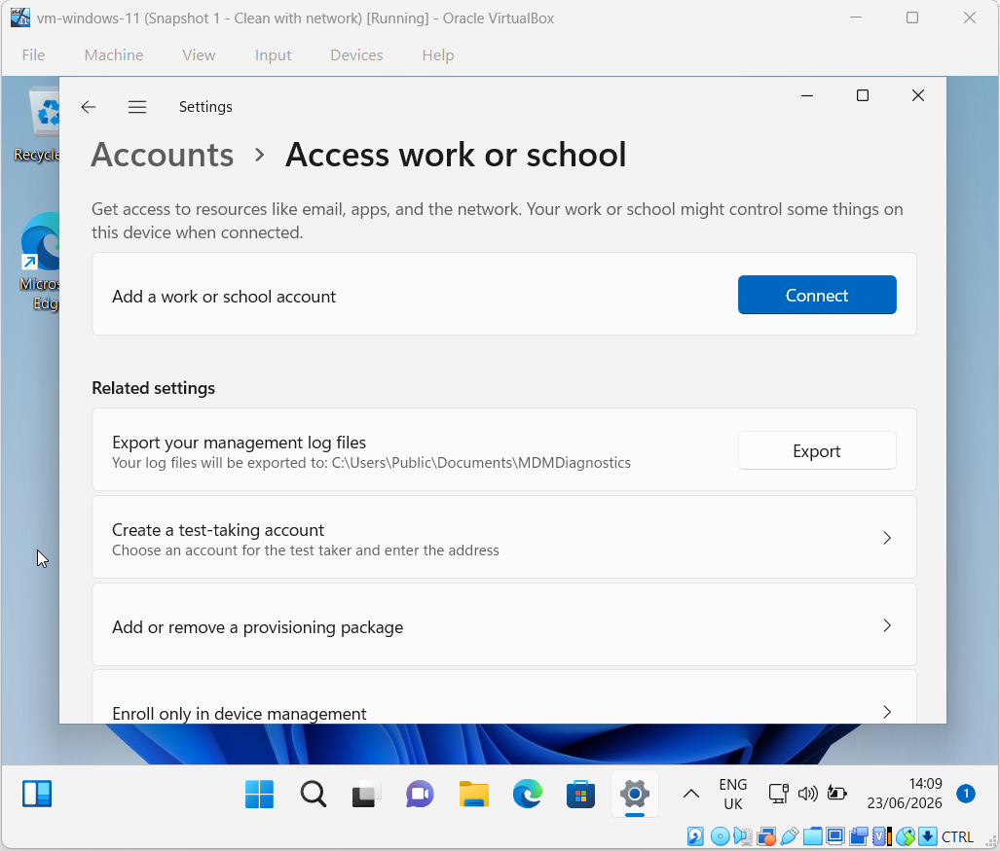
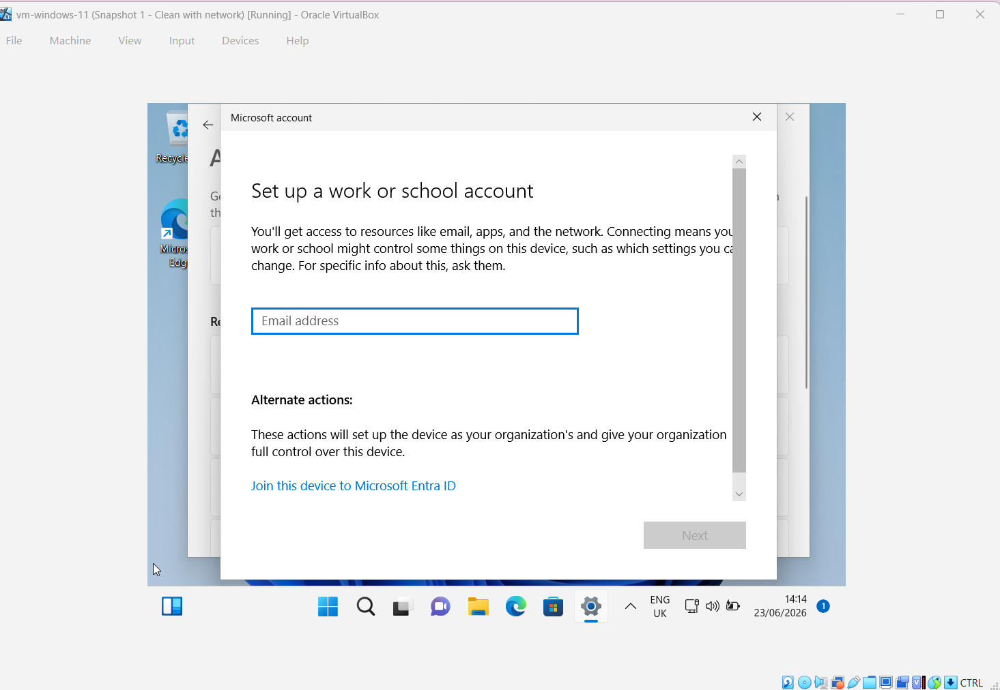
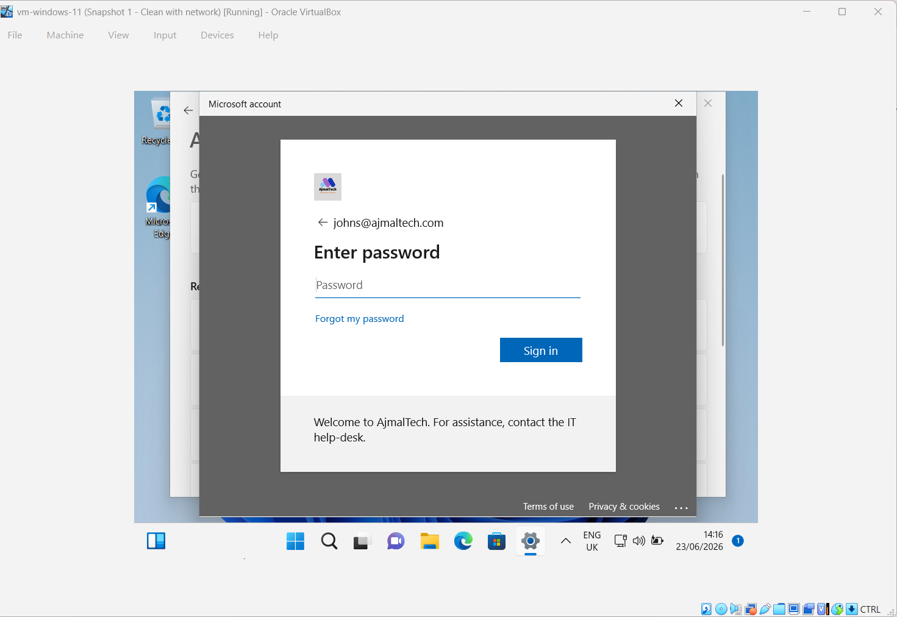
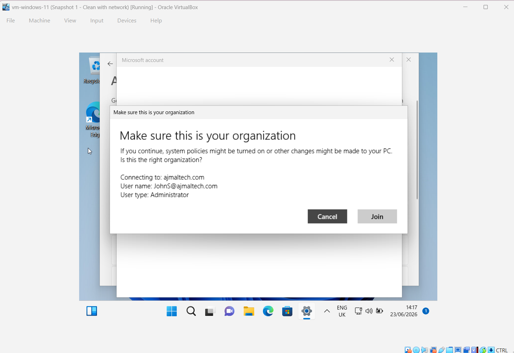
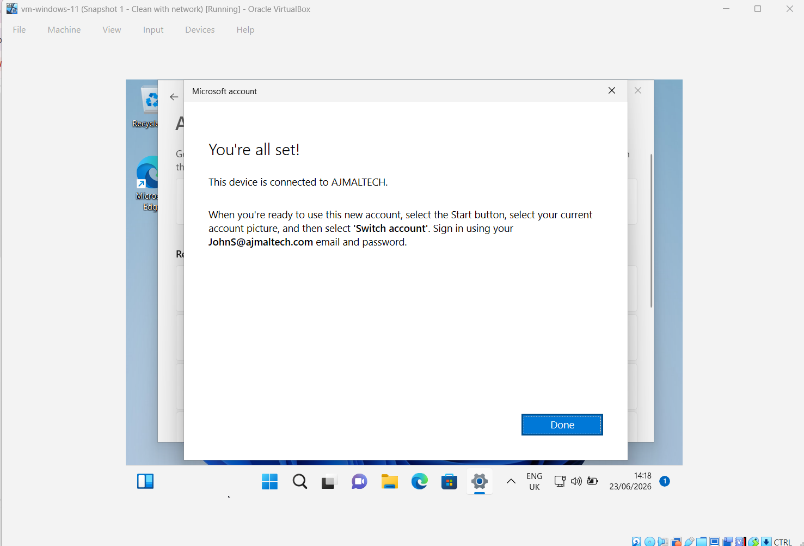
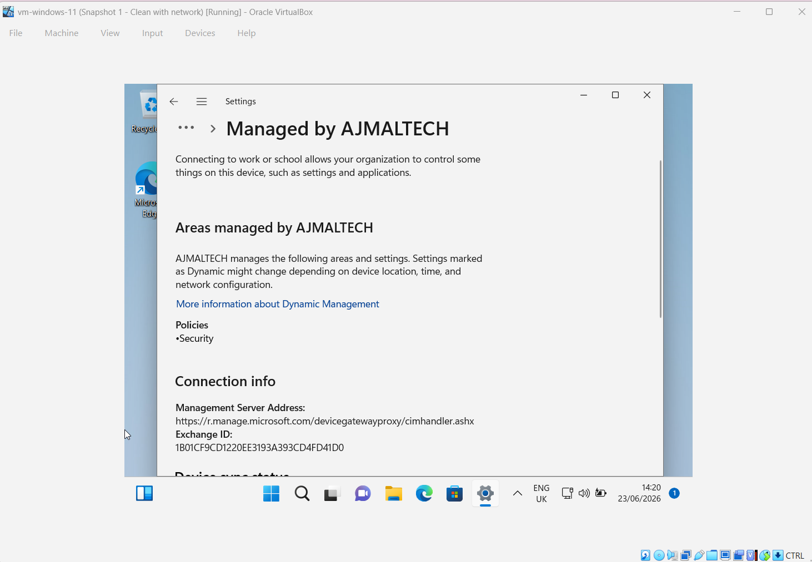
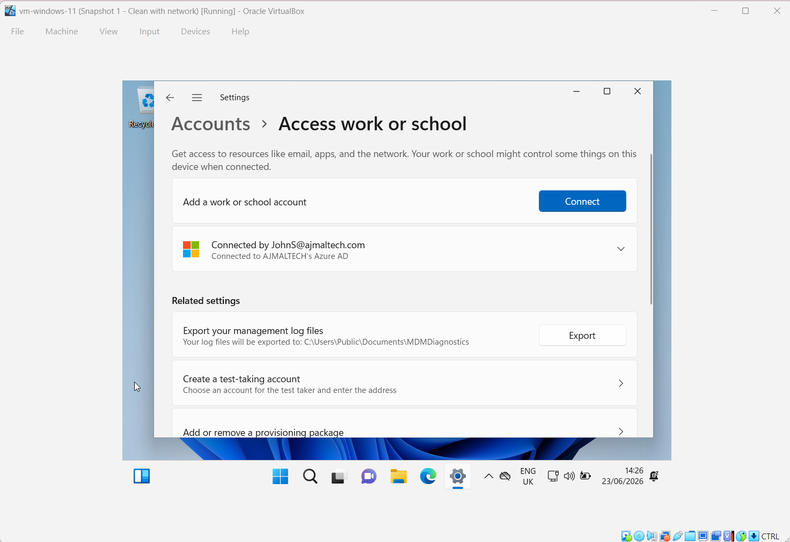
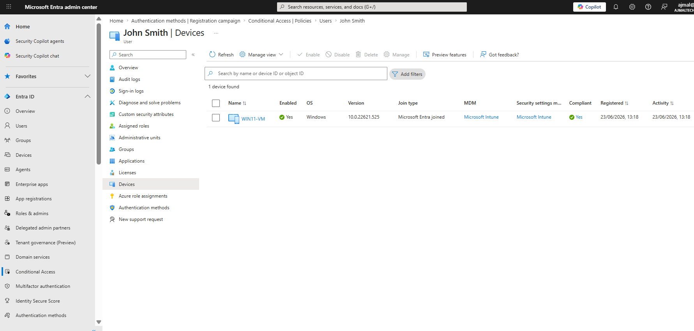
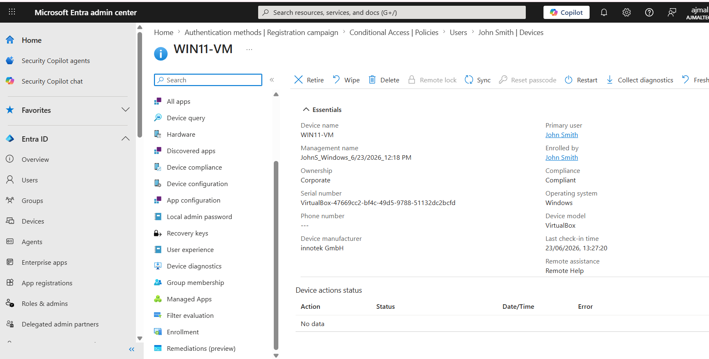

# Configure Microsoft Intune

## Objective

Enroll a Windows 11 device into Microsoft Intune and Microsoft Entra ID for centralized management.

---

## Environment

| Component | Value |
|------------|---------|
| Tenant | AJMALTECH |
| Device | WIN11-VM |
| OS | Windows 11 Pro 22H2 |
| User | JohnS@ajmaltech.com |
| MDM | Microsoft Intune |

---

## Assigned License

User was assigned:

- Microsoft 365 E5 Developer

This license provides:

- Microsoft Intune
- Microsoft Entra ID P2
- Conditional Access
- Microsoft Defender Services

---

## Device Enrollment Process

1. Open:

Settings → Accounts → Access work or school

2. Select:

Connect

3. Choose:

Join this device to Microsoft Entra ID

4. Sign in with:

JohnS@ajmaltech.com

5. Complete MFA verification

6. Confirm organization

7. Finish device enrollment

---

## Verification

### Device Appears in User Profile

User:

John Smith

Device:

WIN11-VM

Status:

- Enabled: Yes
- Compliant: Yes
- Join Type: Microsoft Entra Joined
- MDM: Microsoft Intune

### Device Information

| Property | Value |
|-----------|--------|
| Device Name | WIN11-VM |
| Ownership | Corporate |
| Manufacturer | innotek GmbH |
| Compliance | Compliant |
| Operating System | Windows 11 |

---

## Screenshots

### Before Enrollment

### Enrollment Process

### Verification

---

## Outcome

Successfully enrolled a Windows 11 device into Microsoft Intune and Microsoft Entra ID. Device became compliant and manageable through the Intune Admin Center.